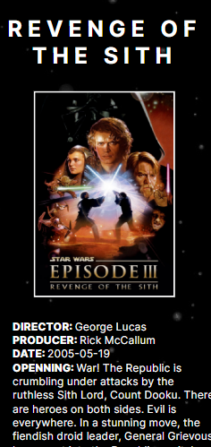
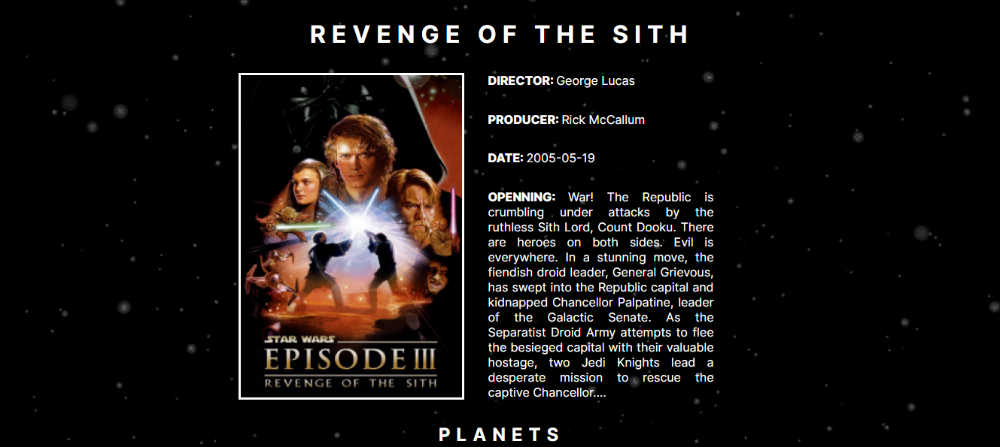
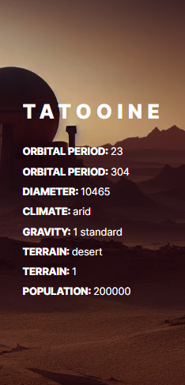
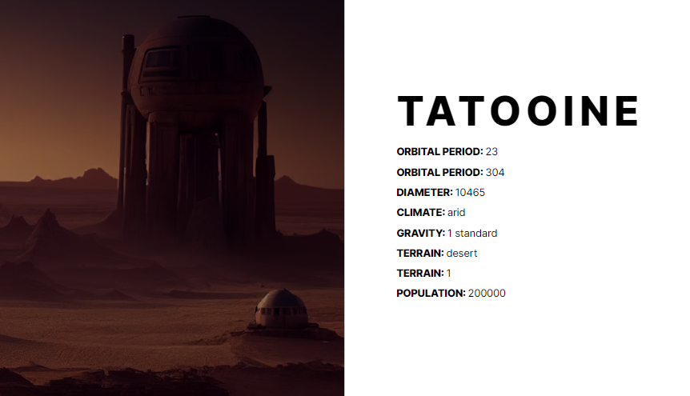

# STAR WARS - SWAPI

| MOBILE                                                                                    |                                           DESKTOP                                            |
| :---------------------------------------------------------------------------------------- | :------------------------------------------------------------------------------------------: |
|  |  |

| MOBILE                                                                                    |                                           DESKTOP                                            |
| :---------------------------------------------------------------------------------------- | :------------------------------------------------------------------------------------------: |
|  |  |

## [Clique aqui](https://viniciuswars.netlify.app/) para acessar o site

   <h1>SOBRE</h1>

Esse projeto foi proposto pelo professor de PWFE (Programação Web Front End) com a finalidade de pôr em prática os dois últimos conceitos aprendidos (componentizar e routerizar), mas para isso o professor nos disponibilizou diversas API's públicas para que escolhéssemos e a selecionada para esse projeto foi a SWAPI (star wars).

   <h1>TO DO LIST:</h1>   

- Desenvolver o site prototipado no figma.
- Criar parte das telas dinamicamente
- Criar no mínimo de 3 telas e usar o route entre elas
- Componentizar

   <h1>TECNOLOGIAS APLICADAS</h1>

- HTML5
- CSS3
- JAVASCRIPT

<h1>FERRAMENTAS</h1> 
       
    
<h1>CONCEITOS APLICADOS</h1>   

- JSON
- API
- ROUTER
- ASYNC & AWAIT

<h1>DOCUMENTAÇÃO</h1>

- [Clique aqui](https://swapi.dev/documentation) para conferir a documentação da API consumida.

   <h1>COLABORADORES</h1>

| NOMES                                                                                                                                                                                      |                                                     GITHUB                                                      |                                       FOTO                                       |
| :----------------------------------------------------------------------------------------------------------------------------------------------------------------------------------------- | :-------------------------------------------------------------------------------------------------------------: | :------------------------------------------------------------------------------: |
|  |  | </a> |
